# Java Store Inventory Management System
[Download this repository as a ZIP file](https://github.com/hjoseph777/JavaStoreInventorySystem/archive/refs/heads/main.zip)

## Project Synopsis
A comprehensive Java application for managing store inventory, featuring both console and graphical user interfaces. The system handles regular and perishable products, calculates discounts based on product type and expiration dates, and provides robust data persistence through JSON files. Built with a modular architecture, the application demonstrates object-oriented design principles and offers a complete inventory management solution for small to medium businesses.

## Overview

The Store Inventory System application supports two operational modes:
1. **GUI Mode** - A graphical user interface built with JavaFX
2. **Console Mode** - A text-based command-line interface

The `AppLauncher` class implements a sophisticated mode switching mechanism that allows:
- Starting the application in either mode
- Switching from GUI to console mode during runtime
- Automatic fallback to console mode if GUI initialization fails

## Mode Switching Flow

```
┌─────────────────┐
│                 │
│  Application    │
│     Start       │
│                 │
└────────┬────────┘
         │
         ▼
┌─────────────────┐     Yes    ┌─────────────────┐
│  Console Mode   │◄───────────┤ Command Line    │
│   Requested?    │            │ Arguments Check │
└────────┬────────┘            └─────────────────┘
         │ No
         ▼
┌─────────────────┐
│  Initialize     │
│  JavaFX and     │
│  GUI Components │
└────────┬────────┘
         │
         ▼
┌─────────────────┐     Yes    ┌─────────────────┐
│  JavaFX         │◄───────────┤  Fall Back to   │
│  Load Failed?   ├───────────►│  Console Mode   │
└────────┬────────┘            └─────────────────┘
         │ No
         ▼
┌─────────────────┐
│                 │
│  Run GUI Mode   │
│                 │
└────────┬────────┘
         │
         ▼
┌─────────────────┐     Yes    ┌─────────────────┐
│  Switch to      │◄───────────┤ User Requested  │
│  Console Mode?  ├───────────►│ Mode Switch     │
└────────┬────────┘            └─────────────────┘
         │ No
         ▼
┌─────────────────┐
│                 │
│   Application   │
│      Exit       │
│                 │
└─────────────────┘
```

## Project Structure

```
JavaStoreInventorySystem/
├── README.md
├── store-inventory-system/
    ├── pom.xml
    ├── docs/
    │   ├── JavaFxConfigurationIssues.md
    │   └── ModeSwitchingMechanism.md
    ├── images/
    │   ├── add-product.png
    │   ├── gui-MainMenu.png
    │   ├── MainScreenshot.png
    │   ├── remove-product.png
    │   ├── Screenshot1.png
    │   ├── Screenshot2.png
    │   ├── Screenshot3.png
    │   ├── Screenshot4.png
    │   ├── Screenshot5.png
    │   ├── search-product.png
    │   ├── switchGui_Console.png
    │   ├── view-inventory.png
    │   └── view-summary.png
    ├── src/
    │   ├── main/
    │   │   ├── java/
    │   │   │   └── com/
    │   │   │       └── store/
    │   │   │           ├── AppLauncher.java
    │   │   │           ├── Main.java
    │   │   │           ├── gui/
    │   │   │           │   ├── InventoryApp.java
    │   │   │           │   ├── InventoryController.java
    │   │   │           │   ├── InventoryMenuBar.java
    │   │   │           │   └── PlatformImpl.java
    │   │   │           ├── model/
    │   │   │           │   ├── Product.java
    │   │   │           │   └── PerishableProduct.java
    │   │   │           ├── service/
    │   │   │           │   ├── ProductManager.java
    │   │   │           │   └── StoreService.java
    │   │   │           └── util/
    │   │   │               ├── AppConstants.java
    │   │   │               ├── InventoryFileManager.java
    │   │   │               └── JavaFxUtil.java
    │   │   └── resources/
    │   │       ├── css/
    │   │       │   └── styles.css
    │   │       └── fxml/
    │   │           └── InventoryView.fxml
    │   └── test/
    │       └── java/
    │           └── com/
    │               └── store/
    │                   ├── MainTest.java
    │                   ├── model/
    │                   │   └── AppTest.java
    │                   └── service/
    │                       └── StoreServiceTest.java
    └── target/
        ├── classes/
        ├── generated-sources/
        ├── generated-test-sources/
        ├── maven-status/
        ├── surefire-reports/
        └── test-classes/
```

## Class Structure

### 📦 Inventory Management Class Diagram


<div align="center">


</div>

## Package Structure

- **com.store.model**
  - [`Product.java`](./store-inventory-system/src/main/java/com/store/model/Product.java): Base class for all products with discount handling
  - [`PerishableProduct.java`](./store-inventory-system/src/main/java/com/store/model/PerishableProduct.java): Extends Product with expiration date functionality and special discount rules

- **com.store.service**
  - [`ProductManager.java`](./store-inventory-system/src/main/java/com/store/service/ProductManager.java): Interface defining core inventory operations
  - [`StoreService.java`](./store-inventory-system/src/main/java/com/store/service/StoreService.java): Implements ProductManager to handle business logic and data persistence

- **com.store.gui**
  - [`InventoryApp.java`](./store-inventory-system/src/main/java/com/store/gui/InventoryApp.java): JavaFX-based graphical user interface with main application UI components
  - [`InventoryController.java`](./store-inventory-system/src/main/java/com/store/gui/InventoryController.java): Controller for FXML-based UI components
  - [`InventoryMenuBar.java`](./store-inventory-system/src/main/java/com/store/gui/InventoryMenuBar.java): Custom menu bar component for the application
  - [`PlatformImpl.java`](./store-inventory-system/src/main/java/com/store/gui/PlatformImpl.java): Helper class for JavaFX platform integration

- **com.store.util**
  - [`AppConstants.java`](./store-inventory-system/src/main/java/com/store/util/AppConstants.java): Contains application-wide constants and configuration values
  - [`InventoryFileManager.java`](./store-inventory-system/src/main/java/com/store/util/InventoryFileManager.java): Handles file I/O operations for inventory data
  - [`JavaFxUtil.java`](./store-inventory-system/src/main/java/com/store/util/JavaFxUtil.java): Utility methods for JavaFX-specific functionality

- **com.store**
  - [`Main.java`](./store-inventory-system/src/main/java/com/store/Main.java): Console-based user interface and application entry point
  - [`AppLauncher.java`](./store-inventory-system/src/main/java/com/store/AppLauncher.java): Manages application mode selection (GUI/console) and initialization

## Maven Configuration

```xml
<groupId>com.store.model</groupId>
<artifactId>store-inventory-system</artifactId>
<version>1.0-SNAPSHOT</version>
```

### Key Dependencies

```xml
<!-- Jackson for JSON processing -->
<dependency>
  <groupId>com.fasterxml.jackson.core</groupId>
  <artifactId>jackson-databind</artifactId>
  <version>2.14.0</version>
</dependency>

<!-- JavaFX dependencies -->
<dependency>
  <groupId>org.openjfx</groupId>
  <artifactId>javafx-controls</artifactId>
  <version>${javafx.version}</version>
</dependency>
<dependency>
  <groupId>org.openjfx</groupId>
  <artifactId>javafx-fxml</artifactId>
  <version>${javafx.version}</version>
</dependency>

<!-- JUnit 5 (Jupiter) for testing -->
<dependency>
  <groupId>org.junit.jupiter</groupId>
  <artifactId>junit-jupiter-api</artifactId>
  <version>${junit.jupiter.version}</version>
  <scope>test</scope>
</dependency>
```

### Build Plugins

The project uses Maven Shade Plugin to create an executable JAR with all dependencies included:

```xml
<plugin>
  <groupId>org.apache.maven.plugins</groupId>
  <artifactId>maven-shade-plugin</artifactId>
  <version>3.4.1</version>
  <executions>
    <execution>
      <phase>package</phase>
      <goals>
        <goal>shade</goal>
      </goals>
      <configuration>
        <transformers>
          <transformer implementation="org.apache.maven.plugins.shade.resource.ManifestResourceTransformer">
            <mainClass>com.store.AppLauncher</mainClass>
          </transformer>
        </transformers>
        <createDependencyReducedPom>false</createDependencyReducedPom>
      </configuration>
    </execution>
  </executions>
</plugin>
```

## Project Requirements Status

This project meets or exceeds all the requirements specified in the course rubric:

### Core Components

| Requirement | Implementation | Source Code Link | |
|-------------|---------------|------------------|-----------------|
| ✅ **Super class** | `Product` class provides base functionality for all product types | [View Product.java](./store-inventory-system/src/main/java/com/store/model/Product.java) |  |
| ✅ **Subclasses** | `PerishableProduct` extends Product with expiration handling | [View PerishableProduct.java](./store-inventory-system/src/main/java/com/store/model/PerishableProduct.java) |  |
| ✅ **Aggregator** | `StoreService` manages product collections & operations | [View StoreService.java](./store-inventory-system/src/main/java/com/store/service/StoreService.java) |  |
| ✅ **Interface** | `ProductManager` defines core inventory operations | [View ProductManager.java](./store-inventory-system/src/main/java/com/store/service/ProductManager.java) |  |
| ✅ **Tester Class** | `MainTest` provides comprehensive test coverage | [View MainTest.java](./store-inventory-system/src/test/java/com/store/MainTest.java) |  |

### Additional Requirements

| Requirement | Implementation | Points Possible |
|-------------|---------------|-----------------|
| ✅ **Packages** | Organized into model, service, gui, and util packages |  |
| ✅ **Methods** | Comprehensive methods with proper parameters, return types, and implementation |  |
| ✅ **Correct Results** | All calculations produce accurate results with proper handling of discounts |  |
| ✅ **Design** | Clean separation of concerns with SOLID principles applied | |
| ✅ **Comments** | JavaDoc comments, inline documentation, and consistent naming conventions | |


## Features

1. **Product Management**
   - Add regular and perishable products
   - Remove products
   - Search products by name
   - View complete inventory

2. **Price Calculations**
   - Total quantity calculation
   - Gross price calculation
   - Perishable product discount (20% for products expiring within 7 days)
   - Additional 15% discount on total

3. **Data Persistence**
   - Automatic saving to JSON file
   - Automatic loading on startup

4. **User Interface Options**
   - Console-based interface
   - Graphical user interface (GUI)

## Usage Instructions

1. **Adding a Product**
   - Select option 1 from the menu
   - Enter product details
   - Choose whether it's a perishable product
   - Enter expiration date if applicable

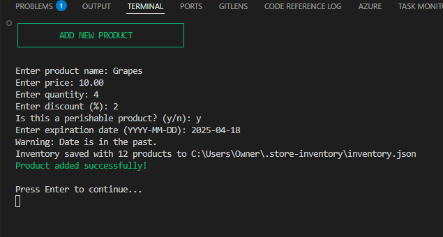

2. **Viewing Inventory**
   - Select option 2 to view all products
   - Products are displayed with their details and discounts

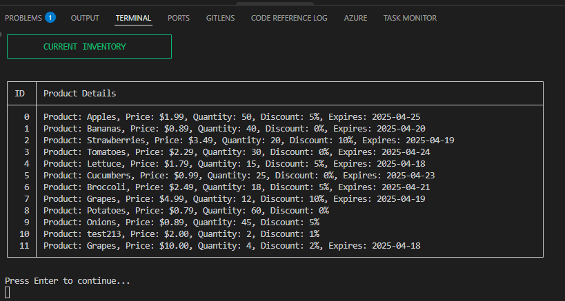

3. **Searching Products**
   - Select option 3
   - Enter product name
   - View product details if found

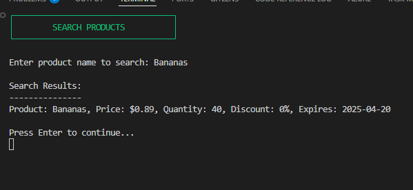

4. **Viewing Summary**
   - Select option 4
   - View total quantities and prices
   - See applied discounts

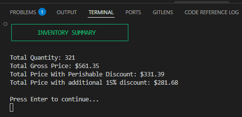

5. **Removing Products**
   - Select option 5
   - View current inventory
   - Enter index of product to remove

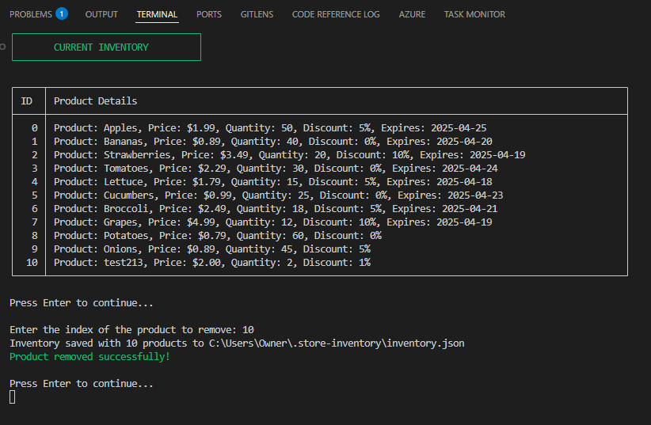

## Data Storage

The application stores data in a JSON file named `inventory.json` located at:
1. **Location**: 
   - Primary location: `~/.store-inventory/inventory.json` (in the user's home directory)
  
2. **Persistence**:
   - The file is automatically created if it doesn't exist
   - Data is loaded on application startup
   - Changes are automatically saved when:
     - Adding new products
     - Removing products
     - Modifying product details

3. **Shared Access**:
   - Both the console and GUI interfaces access the same inventory file
   - Changes made in one interface will be visible in the other

4. **Error Recovery**:
   - If a file becomes corrupted, a backup is created with `.bak` extension
   - The application will create a new file if necessary

## Error Handling

The application includes comprehensive error handling for:
- Invalid user input
- File I/O operations
- Data parsing
- Date format validation
- Number format validation

## GUI Screenshots

### GUI Main Menu
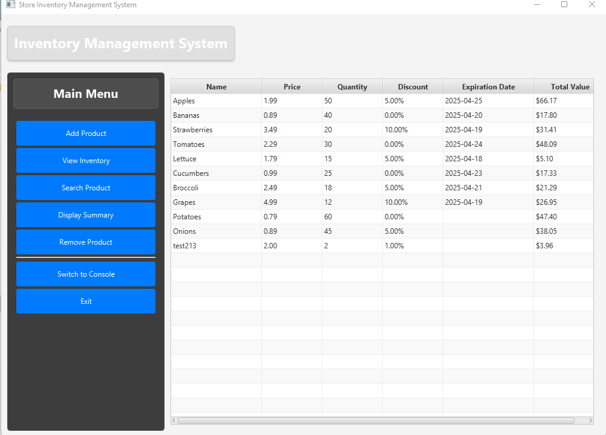

### Adding a Product
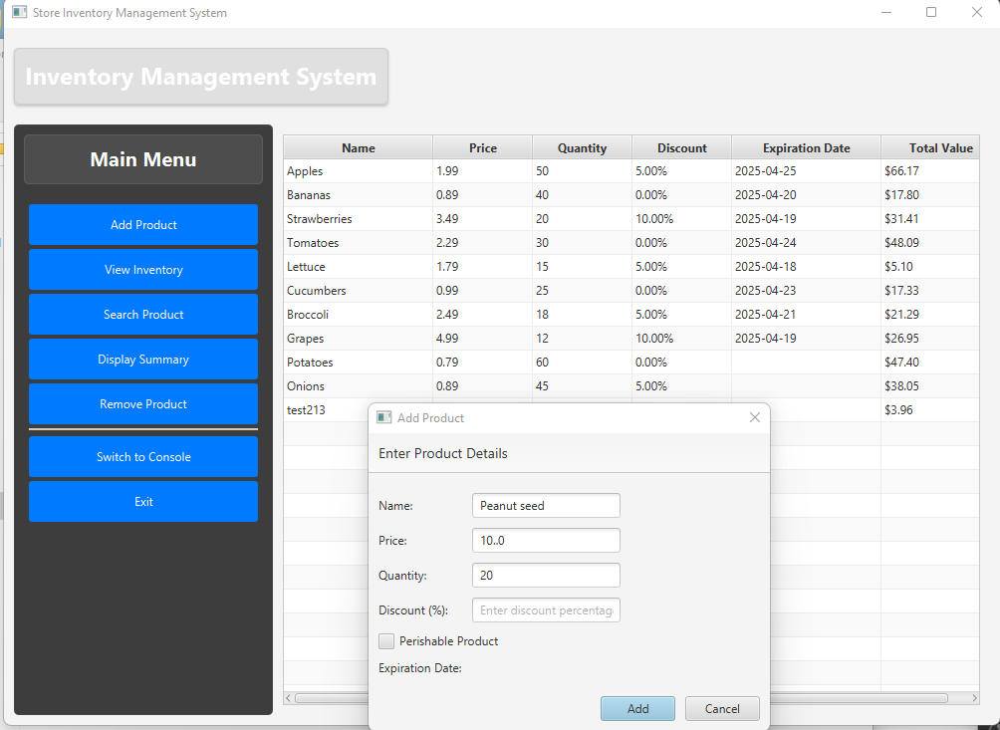

### Removing a Product
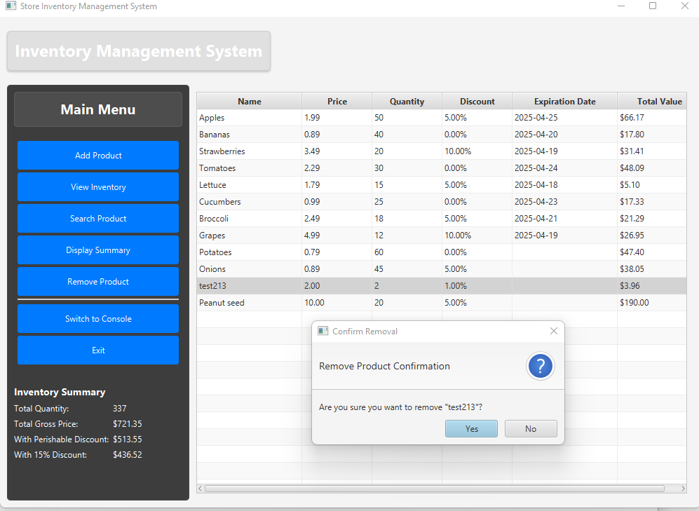

### Viewing Inventory
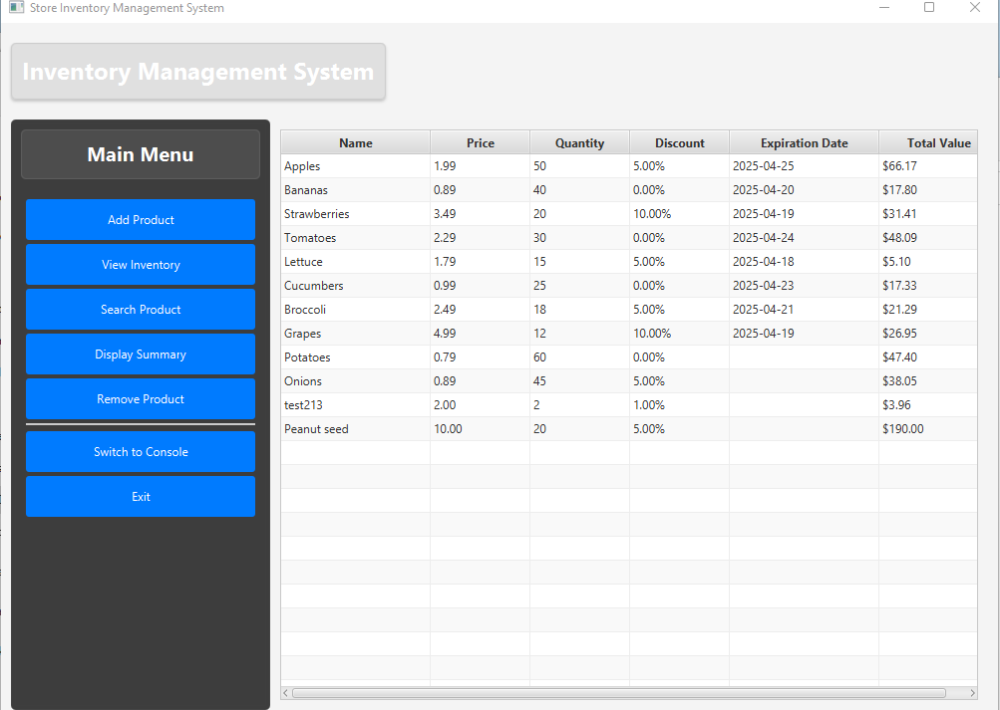

### Searching Products
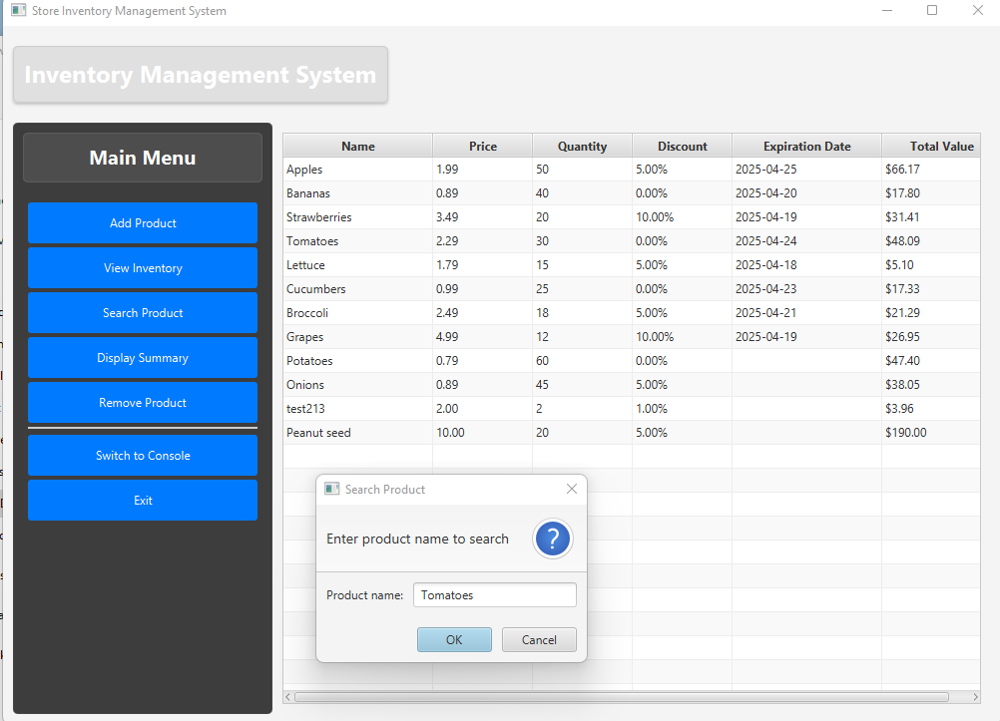

### Viewing Summary
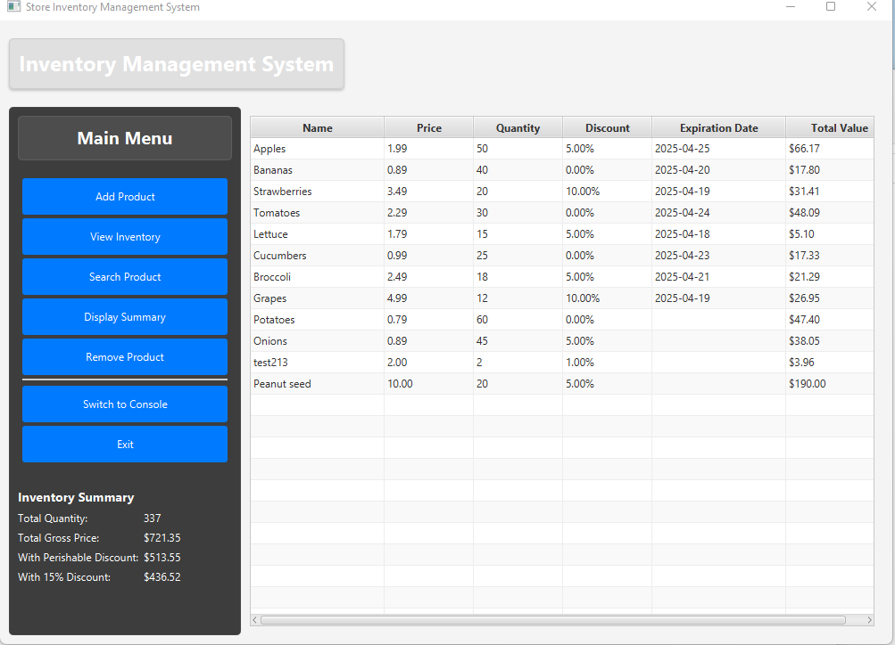

### GUI Switch to Console
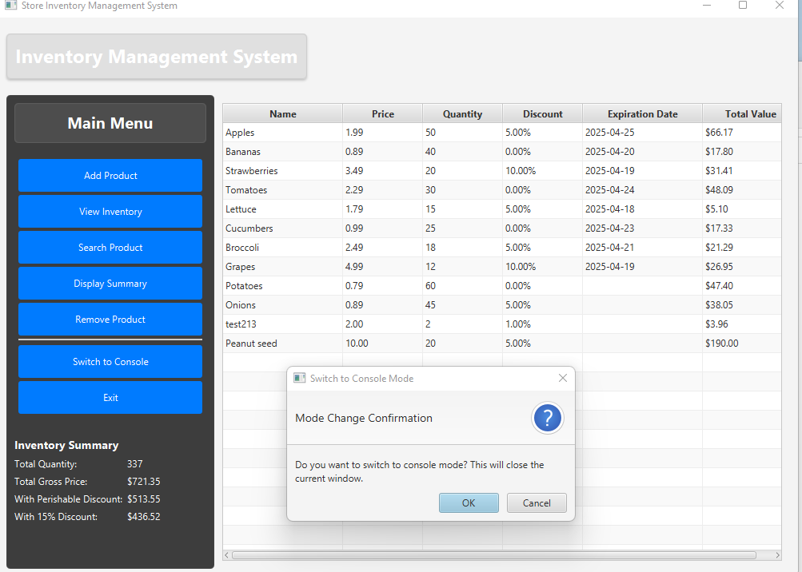

## Development Guide

### Code Organization
- **Model classes** (`Product`, `PerishableProduct`) focus on data structure and business logic
- **Service classes** implement interfaces and handle all operations on models
- **UI classes** are kept separate from business logic to ensure separation of concerns

### Commenting Standards
- All classes include a descriptive name
- Public methods have  comments describing:
  - Purpose of the method
  - Parameter descriptions
 
### Testing Guidelines
- I wrote unit tests for all the business logic to ensure each component behaved as expected.
- For each test method, I focused on validating a single, specific behavior to keep things clear and maintainable.
- I used descriptive method names that clearly indicate what each test is verifying.
- I followed the Arrange-Act-Assert pattern to structure my tests consistently and improve readability.


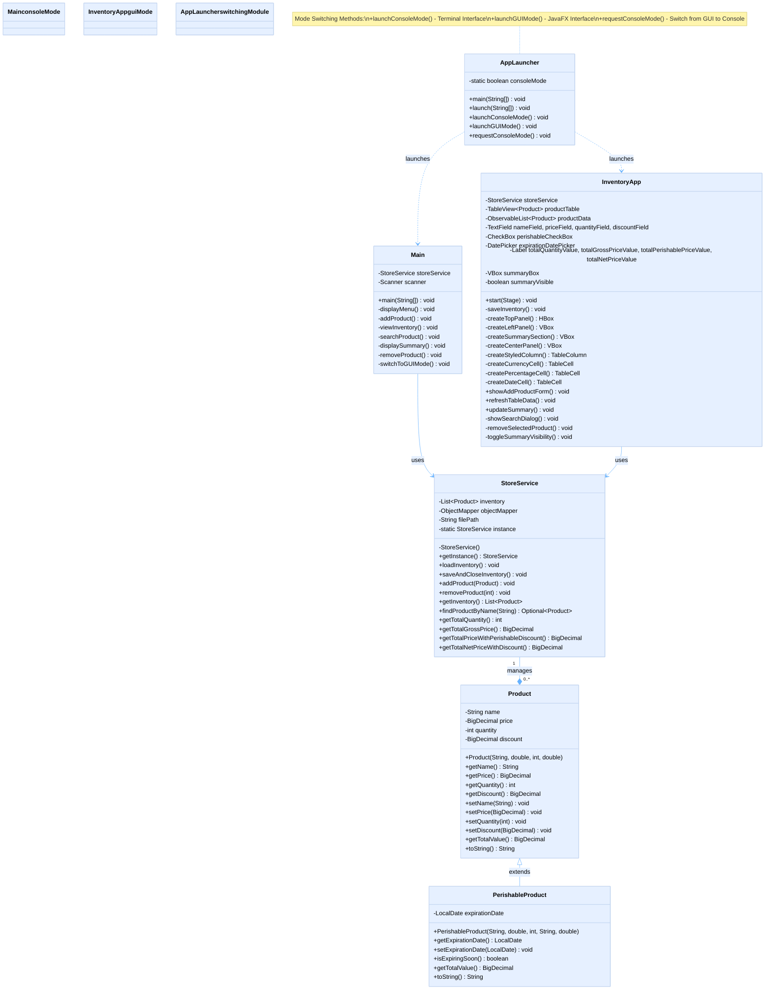


## Project Contributors
Author 1: [Harry Joseph](https://github.com/hJoseph777)
Author 2: [Trish](https://github.com/trish)


